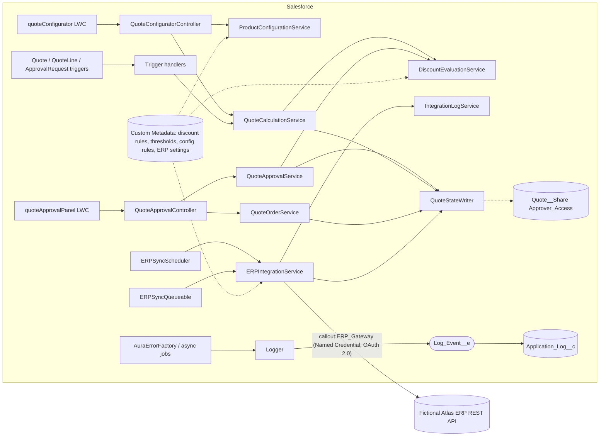
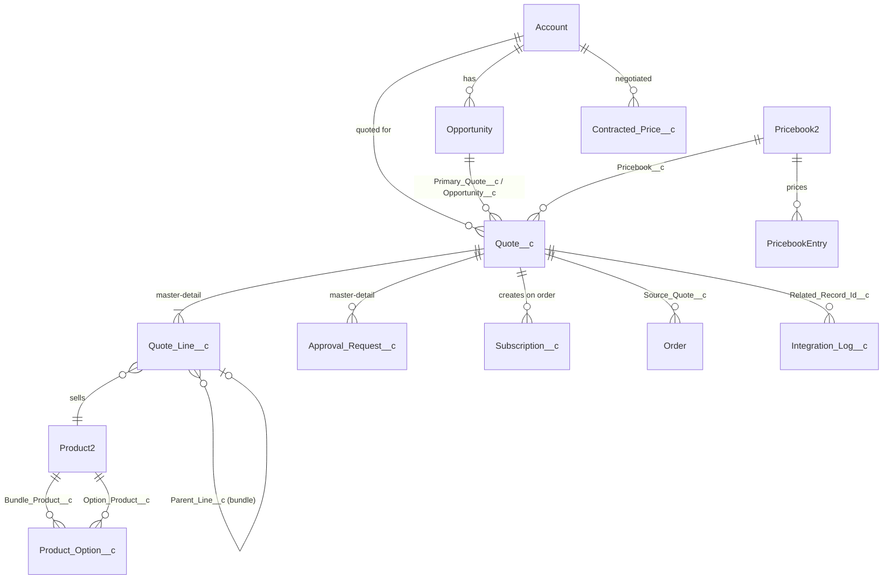

# Architecture

> **Portfolio demonstration.** QuoteFlow CPQ is a fictional B2B software vendor and a design/reference
> implementation. It has not been deployed to a customer org. Sections marked *design specification* describe
> configuration that must be performed in a Salesforce org and is not exercised by the source in this repository.

## 1. Context

A fictional vendor sells modular enterprise software subscriptions plus implementation services. Reps work from an
Opportunity, configure bundles and options, price them with volume schedules and negotiated prices, request approval
when discounts exceed policy, convert approved quotes to orders and have approved quotes synchronised with an ERP.

## 2. System architecture

### Layering

| Layer | Classes | Rules |
|---|---|---|
| Entry points | LWC, `*Controller`, triggers, `ERPSyncScheduler`, `ERPSyncQueueable` | No business rules. Translate input/output and errors only. |
| Trigger handlers | `QuoteTriggerHandler`, `QuoteLineTriggerHandler`, `ApprovalRequestTriggerHandler` | Orchestrate and validate; delegate calculation to services. Static `handle(...)` overloads make them testable without DML. |
| Domain services | `QuoteCalculationService`, `DiscountEvaluationService`, `ProductConfigurationService`, `QuoteApprovalService`, `QuoteOrderService`, `ERPIntegrationService`, `IntegrationLogService`, `QuoteSharingService` | All business logic. Bulk-safe, no UI types except `@AuraEnabled` DTOs that are deliberately defined next to the service that owns the data. |
| Data access (read) | `QuoteSelector` | Every SOQL statement in the domain, `WITH USER_MODE` unless explicitly justified. |
| Data access (elevated write) | `QuoteStateWriter` | The only `without sharing` writer. System-owned fields only (allow-list), only after the calling service has authorised the action; the only place the trigger's service flag is raised. |
| Cross-cutting | `QuoteConstants`, `QuoteTriggerContext`, `QuoteFlowException`, `AuraErrorFactory`, `Logger` | Shared vocabulary, recursion/service flags (private setters), error translation, persistent logging. |

## 3. Data model

See [DATA-MODEL.md](DATA-MODEL.md) for the field-level catalogue. Summary:

Standard objects are used for Account, Contact, Opportunity, Product2, Pricebook2/PricebookEntry and Order/OrderItem.
Quote and quote lines are custom (`Quote__c`, `Quote_Line__c`); see TD-01 for why and what a real CPQ org would do instead.
Master-detail is used where a child cannot exist without its parent and should inherit sharing
(`Quote_Line__c`, `Approval_Request__c`). Where a standard object is the parent (Account, Opportunity, Order), the main
layer uses lookups by choice: standard objects *can* be masters, but a lookup lets `Quote__c` keep its own Private sharing
and owner instead of inheriting the account's. The RevOps Lab shows the other option (`Sales_Subscription__c` is a detail of
Account).

A second, independent layer - the **RevOps Lab** in `revops-lab/` - builds a Sales Cloud quote-to-subscription process on
standard objects with its own custom objects, flows and services. It shares no code with this layer; see
[revops-lab/README.md](revops-lab/README.md).

## 4. Integration architecture

Summarised here, specified in [INTEGRATION.md](INTEGRATION.md): outbound REST/JSON over a Named Credential, a poll-and-lease
dispatcher that runs as a dedicated integration user, per-quote idempotency keys, persisted exponential back-off, and a
sanitised audit log keyed by correlation id.

## 5. Security architecture

Summarised here, specified in [SECURITY.md](SECURITY.md): Private OWD on quotes, role-hierarchy visibility for managers,
Apex managed sharing for out-of-hierarchy approvers, permission set groups per persona, FLS that makes every
system-calculated field read-only to users, and a least-privilege integration permission set.

## 6. Automation architecture

| Concern | Mechanism | Why |
|---|---|---|
| Price calculation, validation, lifecycle enforcement, approval routing | Apex (triggers delegating to services) | Needs bulk-safe multi-record logic, transactional guarantees and unit testability. |
| Reject notification | Record-triggered Flow `QF_Quote_Rejection_Follow_Up` | Declarative, owner-visible, no logic that needs tests. Shipped with `status = Draft`; activate after review. |
| ERP dispatch | Schedulable + Queueable | Callouts cannot run from a trigger transaction that has performed DML; polling gives retry and back-pressure. |
| Log retention | `IntegrationLogPurgeBatch` | Payload columns make unbounded growth a storage risk; purges integration and application logs. |
| Error persistence | `Log_Event__e` (Publish Immediately) + `LogEventTrigger` | Logs must survive the rollback of the transaction that failed. |
| Policy | Custom Metadata | Commercial policy is deployable, reviewable data, not code. |

Order of execution on a line save: before trigger (lock check, included-flag validation, pricing in memory) -> save -> after
trigger (aggregate roll-up onto the quote through `QuoteStateWriter`, which re-enters the Quote trigger in service mode).
On a bundle header delete, the before-delete handler also deletes the header's components.

## 7. Deployment architecture

See [DEPLOYMENT.md](DEPLOYMENT.md). Source-driven development with scratch orgs, feature branches, pull-request validation
in an ephemeral scratch org, promotion through integration and UAT, and a gated production release that quick-deploys the
exact validation of the released commit, with a forward-fix rollback strategy.

## 8. Error-handling strategy

1. **Expected business failures** raise `QuoteFlowException`. Controllers pass the message to the UI.
2. **Per-record failures in bulk operations** are reported per record: `addError` in triggers, `SubmissionResult` for submission, `SyncOutcome` for the ERP. One bad record never hides the others.
3. **Unexpected exceptions** are persisted through `Logger` (platform event → `Application_Log__c`, survives rollback) and surfaced to the user as a generic message carrying the log reference (`AuraErrorFactory`); query text and stack traces never reach the browser. Async entry points (scheduler, queueable, batch) log instead of failing silently.
4. **Transactions**: every multi-step write uses an explicit savepoint and rolls back on any exception (`saveQuote`, `submit`, `decide`, `recall`, `QuoteOrderService.convert`).
5. **Integrations** classify every HTTP outcome as success, retryable or permanent, persist the decision on the quote, and log it. A failure to *log* never fails the business transaction; a failure to *persist* an outcome is logged and healed by the next idempotent attempt.
6. **Lost-update protection**: approval and submission lock the quote and request rows (`FOR UPDATE`) and re-check state after locking.

## 9. Testing strategy

See [TESTING.md](TESTING.md). Policy is injected with `@TestVisible` overrides so tests do not depend on deployed metadata; callouts use `HttpCalloutMock`; security is tested by running as users holding only the shipped permission sets.

## 10. Scalability considerations

* Pricing issues a constant number of queries per transaction regardless of line count (asserted by bulk tests).
* Approver resolution is two queries per approval level, not per quote.
* Bundle configuration is two queries for all bundles in a draft (`ProductConfigurationService.configureAll`), asserted by a test that compares 1 vs 20 bundles.
* ERP throughput: `Batch_Size__c` (5) x `Timeout_Ms__c` (20 s) is chosen so one queueable stays under the 120 s callout budget; at most ten jobs are dispatched per five-minute poll, i.e. about 600 quotes per hour before the schedule or batch size has to be tuned.
* `Integration_Log__c` is write-heavy and read-rarely; keep it out of list views, index `Correlation_Id__c` (external id) and purge on a schedule.
* Row-lock contention is limited to a single quote at a time.

## 11. Technical debt

Catalogued with severity and proposed fixes in [ARCHITECTURE-REVIEW.md](ARCHITECTURE-REVIEW.md); the decisions that created it are in [TECHNICAL-DECISIONS.md](TECHNICAL-DECISIONS.md).
