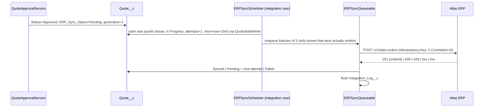

# ERP Integration

The ERP ("Atlas ERP") is **fictional**. The contract below is an assumed design, not a vendor API.

## Pattern

Asynchronous, one-way, request/response push of approved quotes as sales orders.

Eligibility: quotes in status `Approved` **or `Ordered`** (`QuoteConstants.ERP_SYNCABLE_STATUSES`). Converting a quote to a
Salesforce Order is independent of the ERP push and must not strand a sync that is pending or in flight.

Identity and access: everything runs as the integration user. It reads in user mode (View All on `Quote__c` is how it finds work)
but owns no quotes and has **no edit access**; the ERP bookkeeping fields are written through `QuoteStateWriter`, which only accepts
system-owned fields. Earlier revisions wrote in user mode, which silently failed for every quote the integration user did not own.

Why poll rather than call from the trigger: a trigger transaction has done DML, and Apex forbids callouts after uncommitted
work; enqueueing a job per approving user would also run the callout as a sales user and would require every approver to hold
credential principal access. Polling runs under one identity, gives natural retry timing and bounds concurrency.

## Authentication architecture

`callout:ERP_Gateway/v1/sales-orders` -> **Named Credential** `ERP_Gateway` -> **External Credential** `ERP_Gateway_Ext`
(OAuth 2.0 client credentials, one named principal `Integration_Principal`) -> Auth Provider. Salesforce injects and refreshes the
bearer token; Apex never sees it, and the unit test asserts no `Authorization` header is set by code. Principal access is granted
through `QF_Integration_User`. Specifications: `docs/config-specs/` (design only; needs an org-specific Auth Provider and secret).

## Contract

Request headers: `Content-Type`, `Accept`, `X-Correlation-Id` (UUID per attempt), `Idempotency-Key: qf-quote-<quoteId>-g<generation>`, `X-Source-System: QuoteFlow`.

The generation (`ERP_Sync_Generation__c`) is 1 when the quote is approved and increments only when an operator requeues a failed
sync. Retries inside a generation reuse the key, so a lost response cannot create a duplicate order; a requeue gets a new key, so the
ERP does not replay its cached failure for the old one.

Payload: [`samples/erp-order-request.json`](samples/erp-order-request.json). Responses:
[201](samples/erp-order-response-201.json), [409 duplicate](samples/erp-order-response-409-duplicate.json),
[422 validation](samples/erp-order-response-422-validation.json).

Serialisation is typed (`OrderRequest`/`OrderLine` -> `JSON.serialize(obj, true)`, nulls suppressed) so the contract is visible
in code and covered by tests. Decimals are sent as numbers, dates as ISO-8601.

## HTTP status policy

| Status | Meaning | Action |
|---|---|---|
| 200, 201, 202 with `orderId` | Created | `Synced`, store `ERP_Order_Id__c` |
| 409 with `orderId` | We already created it (replay) | Treated as success |
| 2xx without usable body | Unknown outcome | Retry (safe: idempotent) |
| 408, 429, 5xx, `CalloutException` (timeout) | Transient | Retry with back-off; 429 honours `Retry-After` |
| Other 4xx (400, 401, 403, 404, 422...) | Our data or credentials are wrong | `Failed`, no retry, operator action |

## Retry strategy

State lives on the quote, not in memory. `delay = min(base x 2^(attempt-1), 60 min)`, base 2 min, max 5 attempts (metadata). A leased
quote whose worker died is picked up again when the 15 minute lease (`ERP_Next_Attempt_At__c`) expires; after the maximum attempts it is failed
rather than looped. `ERPIntegrationService.requeueFailed` (requires `QF_Requeue_ERP_Sync`) resets failed quotes after the cause is fixed and
starts a new idempotency generation. No jitter is applied (Apex has
no sleep and one scheduler serialises dispatch); add it if more than one dispatcher is ever introduced.

## Governor-limit design

One callout per quote, batches of 5 with a 20 s timeout = 100 s worst case < 120 s callout budget; a runtime guard defers remaining
quotes if the budget is exhausted. Callouts all happen before any DML; quote state and logs are written once at the end.
Up to ten queueables per five-minute poll (limit is 50 per transaction).

## Logging and correlation

Every attempt writes one `Integration_Log__c`: correlation id, endpoint (the Named Credential reference, never the resolved URL), method,
status, duration, attempt, related quote, sanitised request/response bodies (credential-looking properties redacted, 100k character cap)
and error text. The correlation id is the same value sent in `X-Correlation-Id` and in the payload, so a log row can be matched to
an ERP-side trace. Logging is buffered because DML before a callout is illegal. A logging failure never fails the sync; it is reported
through `Logger` to `Application_Log__c`, as are a lease or outcome that could not be persisted and a worker that aborted.

## Operational runbook

| Symptom | Where to look | Action |
|---|---|---|
| Quote stuck `Pending` | `ERP_Next_Attempt_At__c`, scheduled jobs list | Check the 12 `QuoteFlow ERP Sync` schedules exist and run as the integration user |
| Quote stuck `In Progress` | `Application_Log__c` (source `ERPSyncQueueable` / `ERPIntegrationService.*`) | The worker aborted or the outcome could not be saved; the lease expires and the same key is replayed |
| `Failed`, 4xx | `ERP_Last_Error__c`, Integration Log | Fix data (e.g. missing `ERP_Customer_Id__c`), check the ERP has no order for the quote, then `requeueFailed` |
| `Failed`, auth | log rows with 401/403 | Re-authenticate the External Credential principal, then requeue |
| Duplicate order suspected | ERP idempotency key `qf-quote-<id>-g<n>` | Within one generation the ERP should answer 409 with the original order id |

Schedule once, **as the integration user**: `ERPSyncScheduler.scheduleEveryFiveMinutes();`
Schedule once, **as an administrator** (needs Modify All on the log objects; the integration user deliberately cannot delete):
`System.schedule('QuoteFlow Log Purge', '0 0 2 * * ?', new IntegrationLogPurgeBatch());` — purges `Integration_Log__c`, then chains `Application_Log__c`.

## Risks and extensions

No inbound status webhook (ERP-side changes do not flow back), no circuit breaker (a prolonged ERP outage burns attempts for every
quote), single-currency payload, and the response shape is assumed. Extensions: Platform Events for failure alerting, an inbound
REST resource with HMAC signature validation, contract tests against the real ERP sandbox, and a circuit breaker flag in metadata.
