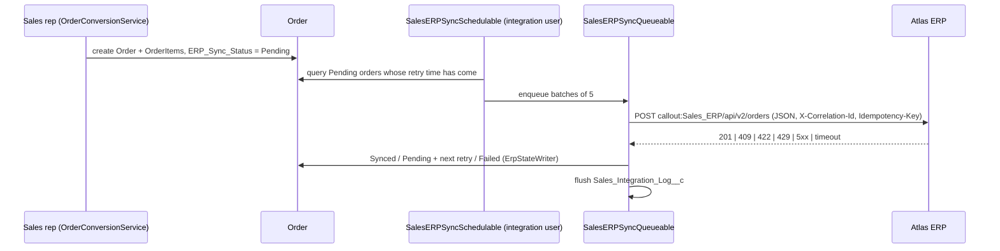

# RevOps Lab - ERP Integration (REST / JSON)

The ERP ("Atlas ERP") is **fictional**; the contract is an assumed design, and no credentials or real endpoints exist in
this repository. Status: deployable source, verified only with `HttpCalloutMock` in Apex tests that have **not yet been run
in an org**. See [ORG-VALIDATION.md](../ORG-VALIDATION.md).

## Flow

## What each requirement looks like in code (`SalesERPIntegrationService`)

| Requirement | Implementation |
|---|---|
| HTTP request | `HttpRequest` POST with `Content-Type` and `Accept: application/json`, timeout from `Sales_ERP_Setting__mdt` |
| Named Credential reference | Endpoint is `callout:Sales_ERP` + path. The URL and OAuth secret live in the Named/External Credential (spec in `config-specs/`). A test asserts no `Authorization` header is set by Apex |
| JSON serialisation | Typed `ErpOrderRequest` / `ErpOrderLine` -> `JSON.serialize(payload, true)` (nulls suppressed) |
| JSON deserialisation | `JSON.deserialize(body, ErpOrderResponse.class)` inside `try/catch (JSONException)`; an unparsable 2xx is treated as an unknown outcome |
| Correlation id | `UUID.randomUUID()` per attempt; sent as `X-Correlation-Id` and in the body; stored on the log row |
| Idempotency key | `Idempotency-Key: sf-order-<Order Id>`; identical on every retry of the same order, so a lost response cannot create a second ERP order |
| Status handling | 200-299 or 409 **with** `erpOrderNumber` -> success (409 = idempotent replay); 2xx without it -> retryable; 408, 429, 5xx, `CalloutException` -> retryable; other 4xx -> permanent |
| Retry classification | Retryable: `ERP_Retry_Count__c + 1`, `ERP_Next_Retry_At__c = now + base x 2^(n-1)` minutes (cap 240), until `Max_Retries__c`; then Failed. Permanent: Failed immediately |
| Error logging | One `Sales_Integration_Log__c` per attempt (endpoint, method, status, outcome, duration, attempt, correlation id, sanitised request/response, error); buffered and flushed after all callouts |
| Governor limits | Callouts first, DML once at the end; stops before the callout count or a 100 s time budget is exhausted; remaining orders stay Pending |

Samples: [samples/](samples/) (request, 201, 409, 422, 503).

## Running it

* Scheduled: log in as the integration user and run
  `System.schedule('RevOps Lab ERP Sync', '0 15 * * * ?', new SalesERPSyncSchedulable());`
* On demand: a user with `Sales_Run_ERP_Sync` calls `SalesERPIntegrationService.requestSync(new Set<Id>{ orderId })`
  (anonymous Apex).
* Without a real ERP the callout fails with a connection error and is classified as retryable - expected. The Apex tests
  use `HttpCalloutMock` for every scenario.

## Compared with the main layer

The main QuoteFlow integration adds a lease-based dispatcher, a sync *generation* in the idempotency key (so an operator
re-send after a fixed 422 is not answered with the cached failure) and persistent application logging. The lab keeps the
simpler per-order key and documents that trade-off rather than duplicating the machinery.
